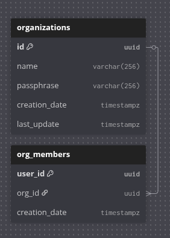

# Организации `(cloud-organizations)`

Реализует [API](../api/organizations.md)

## Запуск

- `JWT_SECURITY_KEY` - ключ для JWT

## БД



```table
Table organizations {
  id uuid PK
  name varchar(256)
  passphrase varchar(256)
  creation_date timestampz
  last_update timestampz
}

Table org_members {
  user_id uuid PK
  org_id uuid
  creation_date timestampz
}

Ref: org_members.org_id > organizations.id
```
