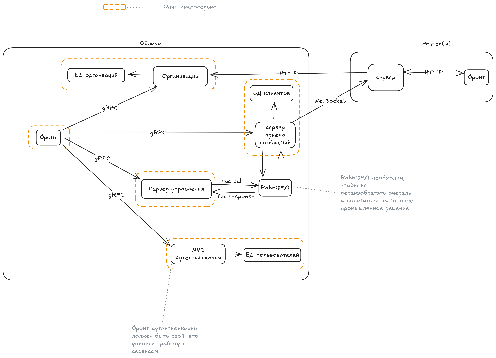

# Юниты

Сервисы или программы задействованные в работе Облака

- [Коннектор](./connector.md)
- [Сервер](./server.md)
- [RabbitMQ](./rabbitmq.md)
- [PostgreSQL](./index.md) // Пока не написана документация
- Роутеры, они же ноды. Для корректной работы Облака они не необходимы, но всё же являются частью системы

Схема:

