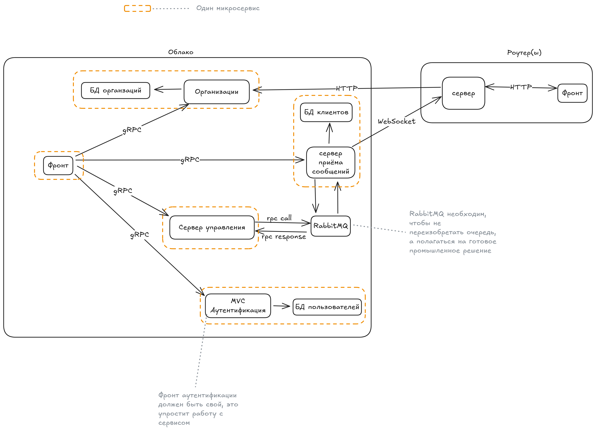

# Юниты

Сервисы или программы задействованные в работе Облака

- [Коннектор](units/connector.md)
- [Сервер](units/server.md)
- [RabbitMQ](units/rabbitmq.md)
- [PostgreSQL](units/units.md) // Пока не написана документация
- Роутеры, они же ноды. Для корректной работы Облака они не необходимы, но всё же являются частью системы

Схема:

